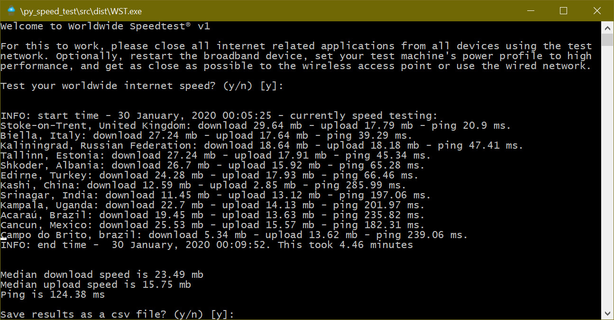

# Worldwide Speed Test (py_speed_test)
Find out your real internet download/upload bandwidth and ping by peering multiple servers spread across the world.

  
## Download links (latest release)
[Windows v1](https://sabercathost.com/i4eD/WST_windows.exe) 
[MacOS/Linux v1](https://sabercathost.com/i4eD/WST_linux.wst)
  
## Built with
  
## Authors
[George Joseph](https://www.linkedin.com/in/gjoseph1/)
  
## License
This project is licensed under the GNU v3 License - see the [LICENSE.md](https://github.com/cibic89/py_speed_test/blob/master/LICENSE.md) file for details
  
## Acknowledgements
Thanks to [sivel](https://github.com/sivel) for his [speedtest-cli](https://github.com/sivel/speedtest-cli/blob/master/speedtest.py) work
